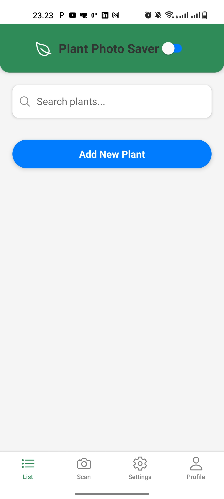
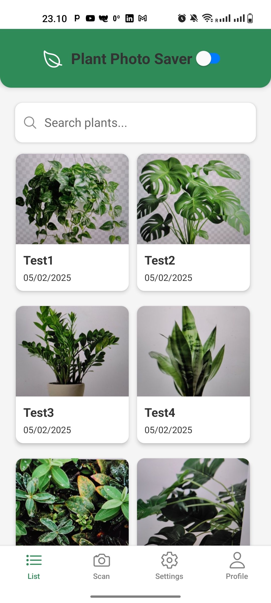
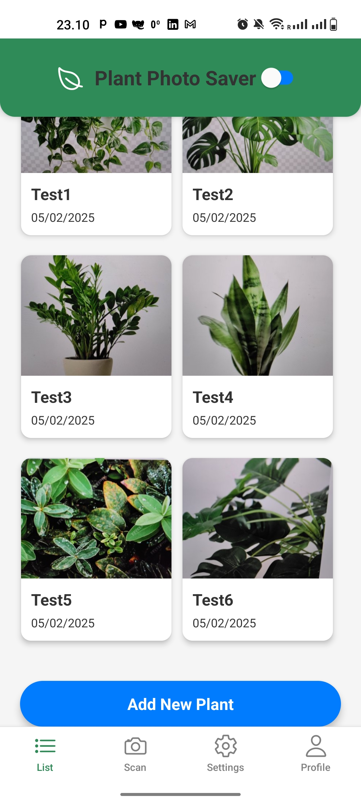
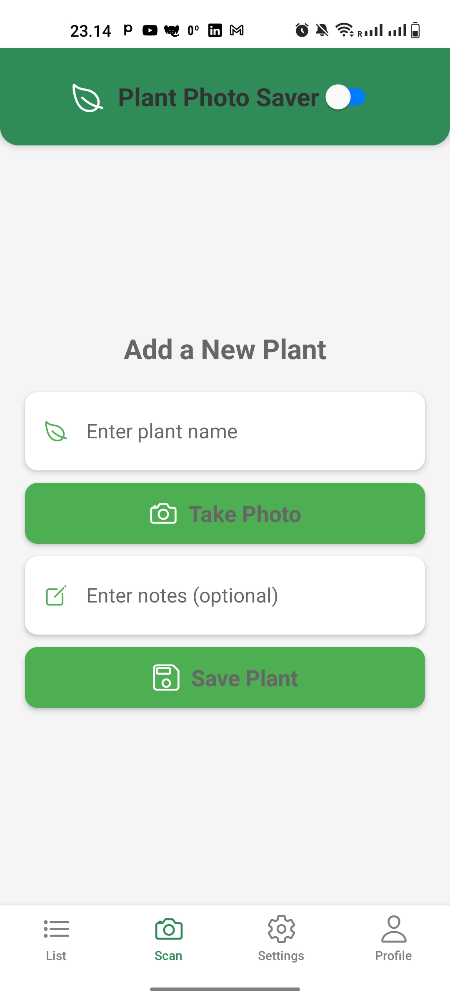
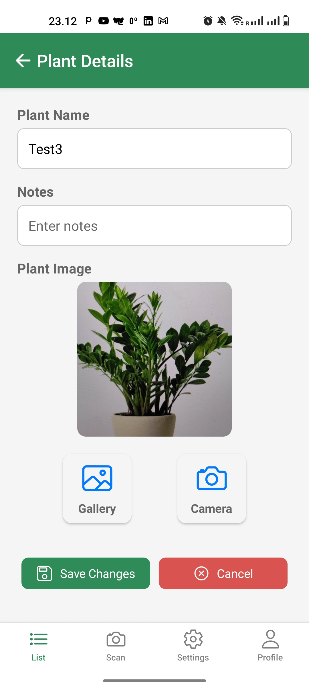

# Plant Photo Saver App

A simple and intuitive mobile app that allows users to capture photos of plants, add their details (name, image, notes), and view them in a list. Built with **React Native** and **Expo**, the app supports both **portrait** and **landscape orientations** for a smooth user experience.

---

## Table of Contents
- [Overview](#overview)
- [Features](#features)
- [Tech Stack](#tech-stack)
- [Architecture & Technical Decisions](#architecture-and-technical-decisions)
- [Screenshots](#screenshots)
- [Installation](#installation)
- [Usage](#usage)

---

## Overview

The **Plant Photo App** enables users to:
- Capture photos of plants using the device camera.
- Add details such as the plant’s name and notes.
- View a list of plants stored in the app, and access detailed information about each one.
- Support for both portrait and landscape orientations for a responsive layout.
- Implemented dark and light theme for all screens.

Built with **React Native**, **Expo**, and **React Context API**, the app is designed for scalability and simplicity, focusing on usability and a minimalistic design.

---

## Features
- **Capture photos**: Take pictures of plants directly using the device camera.
- **Add details**: Enter plant name and notes.
- **View plants list**: See a list of all added plants.
- **View plant Details**: See a details of each plant and allows edit and save the plant details like name, image and notes.
- **Responsive UI**: Supports both portrait and landscape orientations with scrollable content.
- **Navigation**: Easy navigation between the `List`, `Scan`, `Settings`and `Profile` screens using React Navigation.
- **Theme Switching**: Toggle between light and dark themes to change the app's appearance based on user preference.


---

## Tech Stack

- **Frontend**: React Native, Expo
- **State Management**: React Context API
- **Navigation**: React Navigation
- **Camera & Image Picker**: Expo ImagePicker
- **Icons**: Ionicons
- **UUID**: For generating unique plant IDs
- **Theme**: Light and Dark Themes with React Context for global theme management

---

## Architecture and Technical Decisions

### Frontend (React Native with Expo)
- **React Native & Expo**: Chosen for cross-platform support and fast development. Expo simplifies the use of native features like camera functionality and image picking without requiring additional configuration.
- **Modular Components**: The app’s UI is divided into small, reusable components to ensure scalability and maintainability.
- **Screens**:
  - **List Screen**: The screen displays a scrollable list of plants, showing each plant's name, image, and added date. Users can search for plants, tap a card to navigate to the Detail Screen (for viewing/updating plant info), or long-press to enable selection mode. In selection mode, checkboxes appear on cards, and a Delete Selected button allows bulk deletion. An Add New Plant button navigates to the Scan Screen for adding plants. The list is empty initially until plants are added.
  - **Scan Screen**: Captures plant photos, allows users to input plant name and notes, and saves the data.
  - **Detail Screen**: Users can view and edit the plant's details by clicking on each card inn the list, such as its name, photo, and notes.
  - **Settings Screen & Profile Screen**: Empty navigable tabs.
- **Theme Management**: The app allows users to switch between light and dark themes using a toggle button in the header. The current theme is stored in the context and passed down to all screens and components. This provides a consistent look across the app with theme changes reflected instantly.
 

### State Management
- **React Context API** is used to manage the global state of plant data, ensuring the app is simple and easy to scale. Plant data is handled centrally by the `PlantContext` provider, which allows for easy data sharing across screens.
- **Theme Management** is handled by the ThemeContext, allowing users to toggle between the dark and light theme.

### Navigation
- **React Navigation**: Used for managing navigation between the `List`, `Scan`, `Settings` and `Profile` screens. Bottom tab navigation provides a clear and user-friendly way to switch between sections.

### Image Storage
- **Local Image Storage**: Images are stored locally using URI paths, avoiding the need for an external server or database for image storage. This approach is ideal for apps focusing on local data and lightweight functionality.

### Device Orientation & Responsiveness
- The app supports both **portrait** and **landscape orientations** to ensure responsiveness across various screen sizes.
- **ScrollView** is used to allow users to scroll when content exceeds the screen space, particularly in landscape mode.

### Form Validation
- Basic form validation ensures that users provide essential details (e.g., plant name and image) before saving.

### UI/UX Design
- **Minimalistic Design**: A clean and modern user interface focused on simplicity and usability.
- **Ionicons** are used to enhance the visual appeal of buttons and input fields.

### Data Management
- The app uses **React Context API** to manage plant data temporarily in memory. The data is not persisted beyond app usage, suitable for small-scale apps without a need for cloud storage or external databases.

### Error Handling
- Basic error handling includes camera access verification, image picker cancellations, and alerts for incomplete form submissions.

---


<!-- [Download the PDF](./docs/project-documentation.pdf) -->
## Screenshots


*List Screen displaying empty list*


*List Screen displaying all plants*


*List Screen displaying scroll vies and add new plant button*


*Scan Screen to add new plants*


*Detail Screen displaying plant information*


*Detail Screen displaying plant information*


---

## Installation

To get the app running locally, follow these steps:

1. **Clone the repository**:
    ```bash
    git clone https://github.com/LickyHoney/nocfo-plantphotoapp.git
    cd nocfo-plantphotoapp
    ```

2. **Install dependencies**:
    ```bash
    npm install
    ```

3. **Start the app**:
    ```bash
    npx expo start --clear
    ```

4. Open the app in your simulator or device by scanning the QR code with the Expo Go app.

---

## Device Usage

1. Open the app on your device or simulator and connect to the same wifi.
2. On the **Scan Screen**, take a photo of your plant and enter its name and any notes.
3. Press "Save Plant" to add it to the list.
4. View your saved plants on the **List Screen** and tap on any plant to view its details on the **Detail Screen**.

---


